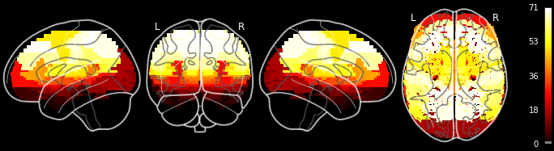
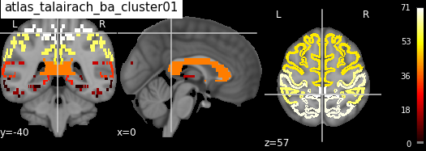
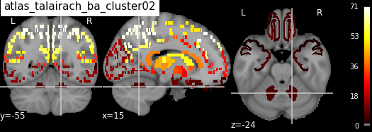
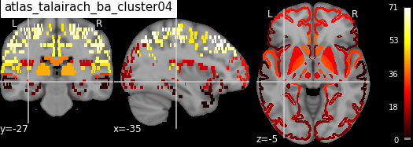
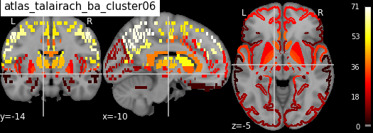
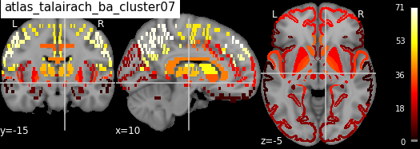
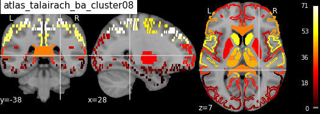
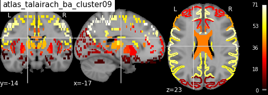
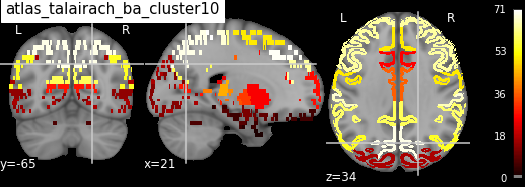

# Summary

A major advantage of magnetic resonance imaging (MRI) over other neuroimaging
methods is its capability to noninvasively locate a region of interest (ROI) in
the human brain. For example, using functional MRI, we are able to pinpoint
where in the brain a certain cognitive process shows higher activation than
usual. But just knowing the Cartesian coordinate of such a ROI is not useful if
we cannot assign it a neuroanatomical label. For this reason, MRI images
are usually normalized into a common template space [@fonov2011unbiased], where
well-established atlases can be used to associate a given coordinate with the
label of a brain region. Most major neuroimaging software packages provide some
functionality to locate the main peaks of an ROI but this functionality is often restricted
to a few atlases, frequently requires manual intervention, does not give the user much
flexibility in the output creation process, and never considers the full extent
of the ROI.

To tackle those shortcomings, we created AtlasReader, a Python interface for
generating coordinate tables and region labels from statistical MRI images. With
AtlasReader, users can use any of the freely and publicly available neuroimaging
atlases, without any restriction to their preferred software package, to create
publication-ready output figures and tables that contain relevant information
about the peaks and clusters extent of each ROI. To our knowledge, providing
atlas information about the full extent of a cluster, i.e. over which atlas
regions does a ROI extent, is a new feature that is not available in any other,
comparable neuroimaging software package.

Executing AtlasReader on an MRI image will lead to the creation of the following
four outputs:

1. An **overview figure** showing the ROIs throughout the whole brain at once
   (Figure 1).
2. For each ROI, an **informative figure** showing the sagittal, coronal and
   transversal plane centered on the main peak of the ROI (Figure 2).
3. A **table** containing relevant information about the main **peaks** in each
   ROI (Figure 3).
4. A **table** containing relevant information about the **cluster extent** of
   each ROI (Figure 4).

Users have many parameters available to guide the creation of these outputs. For
example, with `cluster_extent` a user can specify the minimum number of
contiguous voxels required for a ROI to be shown in the output, `min_distance`
can be used to extract information from multiple peaks within a
given ROI, and `atlas` can be used to specify which atlases should be used for
the output creation. By default, AtlasReader uses the AAL, the Desikan-Killiany,
and the Harvard-Oxford atlases (Figure 3). In the current version, users
also have access to the Aicha, the Destrieux, the Juelich, the Marsatlas, the
Neuromorphometrics, and the Talairach atlas. Further details about the individual atlases,
how to acknowledge them, and their license requirements are detailed in the
[atlasreader/data](https://github.com/miykael/atlasreader/tree/master/atlasreader/data) directory.

AtlasReader is licensed under the BSD-3 license and depends on the following
python libraries: `matplotlib` [@matplotlib], `nibabel` [@nibabel],
`nilearn` [@nilearn], `numpy` [@numpy], `scipy` [@scipy],
`scikitlearn` [@scikitlearn] and `scikitimage` [@scikitimage].

For a more detailed explanation about how AtlasReader works and instructions on
how to install the software on your system, see https://github.com/miykael/atlasreader.

```
import os

os.chdir('../')

os.system("python setup.py install")
```

```
from atlasreader import create_output
file_name = 'atlasreader/data/atlases/atlas_talairach_ba.nii.gz'
create_output(file_name, cluster_extent=5)
```



**Figure 1**: Overview figure showing the ROIs throughout the whole brain at once.


**Figure 2**: Eight cluster figures, each centered on the main peak of the ROI, showing the sagittal,coronal and transversal plane of the ROI.


```
import pandas as pd
df1 = pd.read_csv("atlasreader/data/atlases/atlas_talairach_ba_peaks.csv")
df1
```
**Figure 3**: Example of a peak table showing relevant information for the main peaks of each ROI.This table contains the cluster association and location of each peak, its signal value at this location,the cluster extent (in mm, not in number of voxels), as well as the membership of each peak, givena particular atlas.

```
import pandas as pd
df1 = pd.read_csv("atlasreader/data/atlases/atlas_talairach_ba_clusters.csv")
df1
```

**Figure 4**:Example of a cluster table showing relevant information for the cluster extent of eachROI. This table contains the cluster association and location of each peak, the mean value withinthe cluster, the cluster extent (in mm, not in number of voxels), as well as the membership of eachcluster, given a particular atlas.


# Acknowledgement

Michael Philipp Notter is grateful for the support of the Swiss National Science
Foundation grants, awarded to M. Murray (320030-149982, 320030-169206,
and 51NF40-158776). Kirstie Whitaker is funded through an Alan Turing Institute 
Research Fellowship under EPSRC Research grant (TU/A/000017). This project 
was started at Neurohackademy 2018 which is funded by the National Institute 
of Mental Health through a grant to Ariel Rokem and Tal Yarkoni (R25MH112480).


# References
